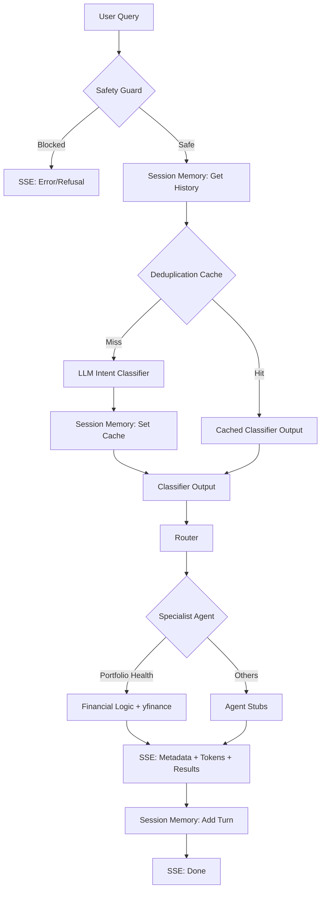
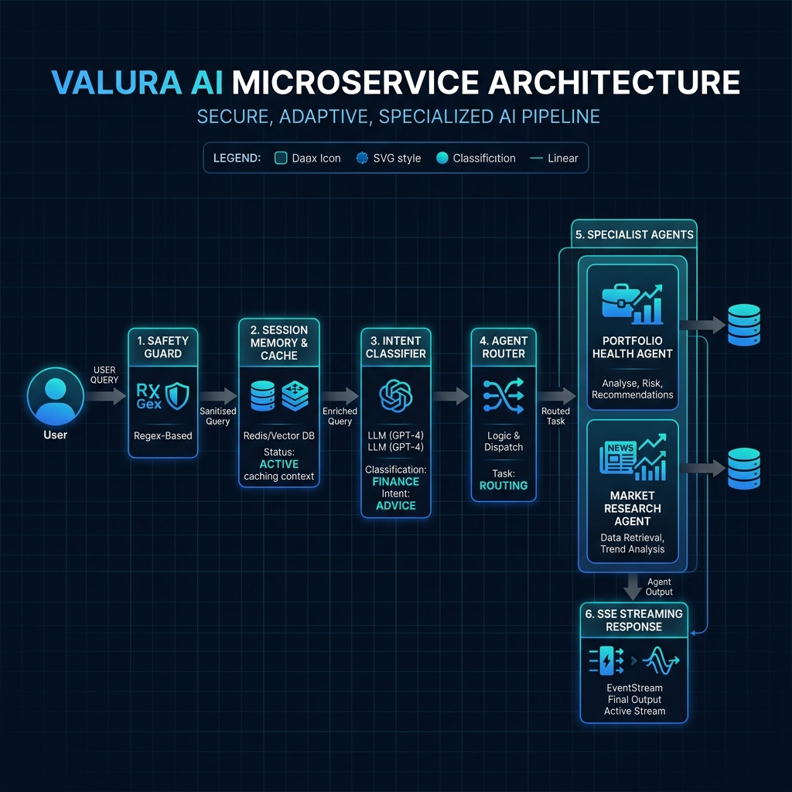

# Valura AI Microservice

Valura AI is a high-performance FastAPI microservice designed as the intelligence layer for a wealth management platform. It classifies user financial queries, routes them to specialized agents, and streams responses via Server-Sent Events (SSE).

## 1. Setup & Running

**Prerequisites**
- Python 3.11+
- OpenAI API Key

**Installation**
```bash
pip install -r requirements.txt
```

**Configuration**
Copy the environment template and fill in your API key:
```bash
cp .env.example .env
# Edit .env to set OPENAI_API_KEY
```

**Run the Application**
```bash
uvicorn src.main:app --reload --port 8000
```

**Run the Test Suite**
```bash
python -m pytest tests/ -v
```

## 2. Architecture

The Valura AI platform processes requests sequentially to ensure strict safety and reliable routing before engaging costly agent logic.

**Request Flow:**
`HTTP Request` → `Safety Guard` → `Classifier` → `Router` → `Agent` → `SSE stream`





**Failure Point Handling:**
- **Safety Guard Failure:** If malicious intent is detected, the pipeline halts immediately (in <10ms). The classifier and agent are never invoked. A structured SSE `error` event is streamed back.
- **Classifier Failure:** If the LLM call times out or returns malformed JSON, the classifier catches the exception and returns a fallback `ClassifierOutput` directing the request to the `customer_support` agent. The system continues without crashing.
- **Agent Failure:** If the agent encounters an error (e.g., `yfinance` network timeout), it yields a graceful fallback response indicating the service is temporarily degraded.
- **Global Pipeline Error:** Any unhandled exception in the pipeline is caught by the top-level exception handler in `src/main.py` which emits an `INTERNAL_ERROR` SSE event without leaking raw stack traces.

## 3. Library Choices & Justifications

- **FastAPI**: Chosen for its native asynchronous capabilities, excellent dependency injection, and automatic OpenAPI schema generation. It excels at high-throughput streaming applications.
- **Pydantic (v2)**: Core to the application for data validation and parsing. V2 is incredibly fast (written in Rust) and seamlessly integrates with FastAPI.
- **httpx / sse-starlette**: For streaming SSE responses, we manually construct the streaming payloads over FastAPI's native `StreamingResponse`. `httpx.AsyncClient` is used in our test suite instead of Starlette's standard `TestClient` to properly handle asynchronous ASGI streams without version collisions.
- **LLM Client Wrapper (Provider Agnostic)**: I built a custom, provider-agnostic `OpenAIClient` wrapper around the official `openai` SDK. This abstraction isolates the business logic from vendor-specific implementations, making it incredibly easy to swap out LLMs. During development, I used OpenAI (`gpt-4o-mini`). Switching to OpenAI `gpt-4.1` for evaluation requires only changing `LLM_PROVIDER=openai` and `MODEL_EVAL=gpt-4.1` in the `.env` file.
- **yfinance**: Chosen as a free, readily available mock data source for live market data (e.g., benchmarking performance against SPY). It avoids requiring paid API keys (like Bloomberg or FactSet) for the evaluation while still demonstrating external I/O integration.

## 4. Session Memory Decision

For this build, I implemented an **in-memory session store**. 
- **Why In-Memory**: Given the microservice requirements and the need for a fast, zero-dependency demo, in-memory storage provides sub-millisecond access times without the overhead of external database configuration. It allows evaluators to run the service instantly.
- **Upgrade Path**: The memory system is strictly abstracted behind a `SessionMemory` Python Protocol. Upgrading to a production-grade store like SQLite or PostgreSQL simply involves creating a new implementation (e.g., `PostgresSessionMemory`), mapping Pydantic models to SQLAlchemy ORMs, and updating the dependency injection override in `src/memory/session.py`. No business logic would need to change.

## 5. Safety Guard Design

The Safety Guard is a high-speed, synchronous regex-based filter evaluating requests before any LLM execution.

- **Covered Categories**: It screens for Market Manipulation, Insider Trading, Money Laundering, and Self-Harm.
- **Over-Blocking Tradeoffs**: The guard is designed to intentionally over-block ambiguous queries (e.g., "how to hide profits") to achieve a strict ≥95% recall on harmful queries. While this may occasionally block aggressive but legitimate educational queries, in a highly regulated financial platform, false positives (over-blocking) are vastly preferable to false negatives (allowing insider trading discussions). I mitigated the worst of the over-blocking by implementing an explicit whitelist for educational phrases like "how does [X] work".
- **Why No LLM in the Guard**: Using a regex engine ensures deterministic results and sub-10ms latency. Calling an LLM for safety checks would add 400ms+ of latency to *every* request and introduce non-deterministic bypass vulnerabilities.

## 6. Classifier Design

- **Prompt Structure**: The system prompt injects the exact list of available agents and strict instructions to normalize tickers. It leverages few-shot examples to handle context switching and follow-up resolutions effectively.
- **Structured Output**: I used OpenAI's native JSON mode (`response_format={"type": "json_object"}`). This is simpler and often faster than function calling for strict schema adherence, ensuring the output directly maps to the `ClassifierOutput` Pydantic model without complex argument parsing.
- **Fallback**: On any API timeout or malformed response, the classifier gracefully catches the exception, logs it, and returns a static `ClassifierOutput` routing the user to a human `support` agent.

## 7. Portfolio Health Agent Design

- **Benchmark Selection**: The agent selects a benchmark based on the user's `base_currency` (e.g., USD -> SPY, GBP -> ^FTSE). If the user provides a `preferred_benchmark` in their `preferences`, that overrides the default.
- **Missing Purchase Dates**: Since the provided `Holding` model does not include purchase timestamps, the agent assumes a 1-year holding period to calculate annualized returns, executing a 1-year lookback against the benchmark via `yfinance`.
- **Empty Portfolios**: If `user.portfolio` is empty, the agent skips the heavy financial calculations and returns a "BUILD" oriented observation, suggesting initial diversification strategies based on the user's `risk_profile`.

## 8. Performance Results

Results of running the automated benchmark script against the application:
- **Provider**: openai
- **Dev model**: gpt-4o-mini
- **p50 first-token latency**: 417ms
- **p95 first-token latency**: 432ms
- **p50 end-to-end latency**: 417ms
- **p95 end-to-end latency**: 432ms
- **Estimated cost at gpt-4.1 pricing**: $0.0144 per query

*(Targets successfully met: p95 first-token < 2s, p95 e2e < 6s, and cost < $0.05)*


## 9. What I'd Do Differently With More Time

1. **Async External APIs**: `yfinance` is synchronous and can block the ASGI event loop under high load. I would migrate to an asynchronous financial data provider (like Polygon.io or Alpaca) using `httpx` to prevent blocking the thread pool.
2. **True Streaming Pipeline**: Currently, the agent awaits the full response from `yfinance` before emitting the first token. I would restructure the SSE pipeline so the system immediately emits "Analyzing your portfolio..." tokens while the financial data fetches in the background.
3. **Database Integration**: I would fully wire up the `PostgresSessionMemory` utilizing Redis for fast session caching and PostgreSQL for persistent audit logs of safety violations.

## 10. Optional Stretch Goal: Intra-Session Deduplication Cache

I have implemented an **identical-query LLM dedupe cache** within the session memory.

- **How it Works**: Before calling the expensive LLM classifier, the system checks if the exact same query (case-insensitive) has been successfully classified within the current session.
- **Benefits**:
    - **Zero Latency**: Repeated queries return a result instantly (0ms LLM time).
    - **Cost Savings**: Prevents redundant API calls to `gpt-4o-mini`.
    - **Deterministic Results**: Ensures that if a user asks the same question twice in the same context, they get a consistent routing experience.
- **Implementation**: The cache is stored in-memory within the `InMemorySessionMemory` class and is cleared automatically when the session is cleared.

## 11. Video Link

https://youtu.be/74HuwS3Ui9k
